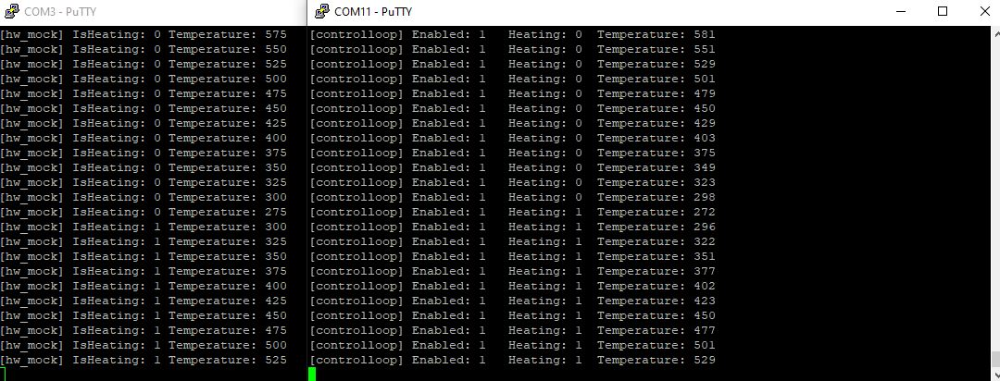

# About
Demonstration of hardware in the loop (HiL) Testing using 2 ARM Cortex-M Boards.

# Task
A Software is to be written, that controls the temperature of a room.
For quick roundtime and quality checks, this Software needs testing, this testing is to be done as cheap but as good as possible with quick response time.

# Solution
I took two STM32F4 discovery boards. One is running the Software to be tested and another board, that runs a simulation of mechanics and physics.

For testing purposes 2 Testmodes are available:
- Step by step testing by setting Signals
- HW Mock, where the Testboard simulates the mechanics and physics continously

| Control | Testboard | Signal |
|---------|-----------|-----------------------------------------------------------------|
| aIn1		| aOut0     | Voltage of analog temperature sensor (eg. PT1000)               |
| aOut0		| aIn1      |                                                                 |
| led2		| in0       | Heating signal, when high Heater is expectet to heat            |
| led3		| in1       |                                                                 |
| in0			| led2      | Heating enable, when high temperature regulation is enabled (eg. a switch)|
| in1			| led3      |          |

# Requirements
[Gherkins Requirements](https://gitlab.com/dominik.gausa/csharp_bdd/-/blob/master/Features/embedded.feature)
