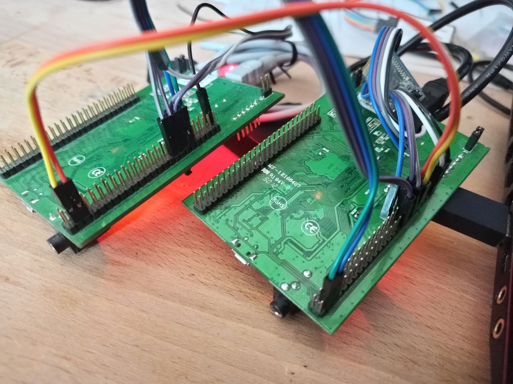
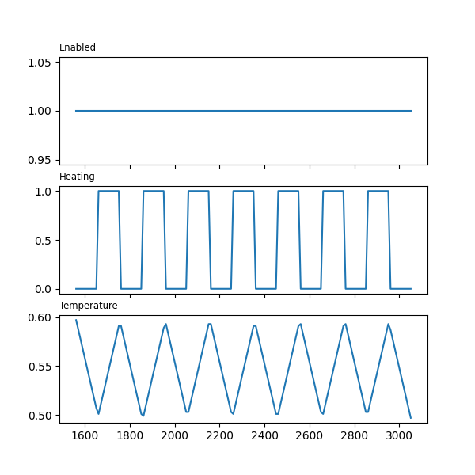

# About
Demonstration of hardware in the loop (HiL) Testing using 2 ARM Cortex-M Boards.

# Task
A Software is to be written, that controls the temperature of a room.
For quick roundtime and quality checks, this Software needs testing, this testing is to be done as cheap but as good as possible with quick response time.

# Solution
I took two STM32F4 discovery boards. One is running the Software to be tested and another board, that runs a simulation of mechanics and physics.

For testing purposes 2 Testmodes are available:
- Step by step testing by setting Signals
- HW Mock, where the Testboard simulates the mechanics and physics continously





| Control      | Testboard | Signal |
|--------------|-----------|-----------------------------------------------------------------|
| aIn1 (PA07)	 | aOut0     | Voltage of analog temperature sensor (eg. PT1000)               |
| aOut0	(PA04) | aIn1      |                                                                 |
| led2 (PD13)	 | in0       | Heating signal, when high Heater is expectet to heat            |
| led3 (PD15)  | in1       |                                                                 |
| in0	(PA00)   | led2      | Heating enable, when high temperature regulation is enabled (eg. a switch)|
| in1	(PA01)   | led3      |          |
| TX2 (PB06)   | RX2       |          |
| RX2 (PB07)   | TX2       |          |





```
Feature: Processor in the Loop

  Scenario: Run Enabled 250-750 
    Given device
    And set_temp_min is set to 250
    And set_temp_max is set to 750
    And sig_led2 is set to 1      
    When running 30s
    Then pass

  Scenario: Run Enabled 500-600 
    Given device
    And set_temp_min is set to 500
    And set_temp_max is set to 600
    And sig_led2 is set to 1
    When running 30s
    Then pass

  Scenario: Run 2s Disabled 
    Given device
    And sig_led2 is set to 0
    When running 10s
    Then pass
    
2 features passed, 0 failed, 0 skipped
6 scenarios passed, 0 failed, 0 skipped
25 steps passed, 0 failed, 0 skipped, 0 undefined
Took 1m11.753s
```

# Requirements
BDD requirements & testing using [C# Specflow](https://gitlab.com/dominik.gausa/csharp_bdd/-/blob/master/Features/embedded.feature)

BDD requirements & testing using [Python Behave](
https://gitlab.com/dominik.gausa/zephyr-os-multiboard/-/blob/master/features/PiL.feature)
